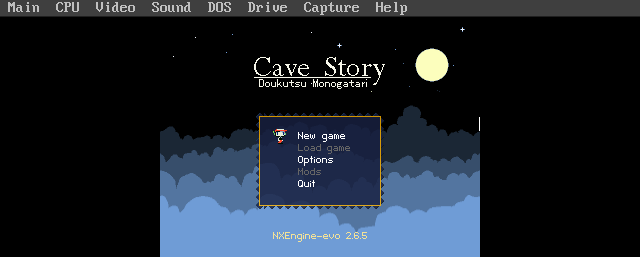

# doskutsu — Cave Story on MS-DOS

The reference port. Cave Story (via NXEngine-evo) running on real
486/Pentium-class DOS hardware through SDL3, DJGPP, and CWSDPMI.

Repo: https://github.com/ecliptik/doskutsu

## Screenshots

| Title screen | First cave | First room |
|---|---|---|
|  |  |  |

## Features

- 32-bit protected-mode DOS via DJGPP + CWSDPMI.
- SDL3 running on DOS (VESA graphics, keyboard, gameport joystick).
- Sound Blaster 16 PCM, OPL2/OPL3 FM, MPU-401/WaveBlaster, Gravis
  UltraSound/PicoGUS — full DOS-era audio hardware coverage.
- DOS-style `SETUP.EXE` for configuring video/audio/input.
- DOSBox-X + 86Box automated smoke tests, plus real-hardware validation.
- Full game, save/load, all seven music backends selectable.

## Performance (real hardware, round M)

Frames per second of game time, same 102-second recorded input replay on
every configuration, S3 ViRGE + PicoGUS held fixed so only CPU varies:

| CPU | AdLib | OPL3 FM | Organya |
|---|---:|---:|---:|
| Pentium OverDrive 83 | **32.2** | 30.2 | 27.7 |
| Am5x86-133 | **32.1** | 30.5 | 27.6 |
| 486DX2-66 | **24.0** | 22.2 | 19.8 |
| 486DX2-50 | **17.8** | 17.1 | 14.6 |

Measurement noise floor is ~0.2 fps (back-to-back identical cells on the
same machine). Full methodology and raw per-cell logs:
[doskutsu's `docs/BENCHMARKS.md`](https://github.com/ecliptik/doskutsu/blob/main/docs/BENCHMARKS.md)
and [`qa-results/`](https://github.com/ecliptik/doskutsu/tree/main/qa-results).

## Hardware notes

Minimum: 486DX2-66 with FPU, 16 MB RAM, VESA 1.2+, Sound Blaster 16
compatible. Recommended: Pentium 75+, 32 MB RAM. See this hub's
`HARDWARE.md` for the shared reference matrix doskutsu's numbers above are
drawn from.

## Status

`RELEASE_READY`. See this hub's `ports.yaml` for the tracked entry. Not yet
migrated to consume this hub's `shared/` layer via submodule — see
`plans/META-REPO-PLAN.md` step 5 for that migration.
