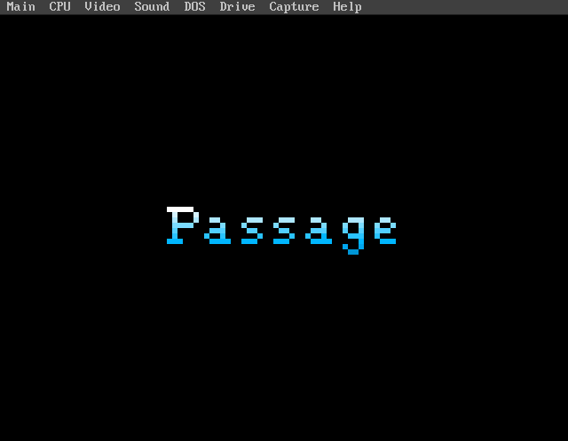
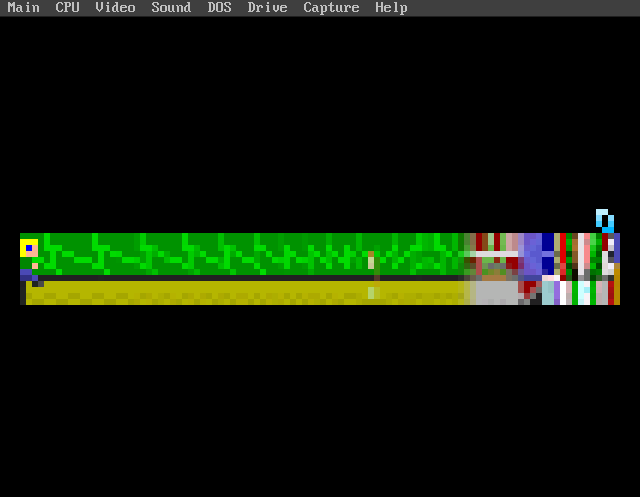

# dossage — Passage on MS-DOS

Passage (Jason Rohrer, 2007) running on real 486/Pentium-class DOS
hardware through SDL3, DJGPP, and CWSDPMI. A tiny, single-idea game --
a 100x16-pixel window that widens and narrows as a couple ages, marries,
and dies over a fixed ~5-minute life -- ported end to end as a reference
skeleton for this hub's smaller SDL 1.2 titles.

Repo: https://github.com/ecliptik/dossage

## Screenshots

| Title screen | Gameplay |
|---|---|
|  |  |

## Features

- 32-bit protected-mode DOS via DJGPP + CWSDPMI.
- SDL3 running on DOS (VESA graphics, keyboard input).
- Custom sample-level software-synth audio (Timbre/Envelope) -- no
  SDL_mixer, no file-based sample decode.
- Custom uncompressed `.tga` image decoder (minorGems) -- no SDL_image.
- Settings persistence via `.ini` files; full game, death, and
  fade-to-title/replay loop confirmed end to end on real hardware.
- Engine and game data both public domain from the same author (see
  the port repo's own `LICENSE-REVIEW.md`) -- this port ships its own
  assets, unlike doskutsu's user-supplied Cave Story data.
- DOSBox-X automated smoke tests plus a full real-hardware 3-card x
  4-CPU performance matrix (below).

## Performance (real hardware)

Passage's own source pins a fixed design target --
`gameSource/game.cpp` sets `int lockedFrameRate = 15;` -- so this port's
KPI is a **15 fps pacer ceiling**, not uncapped throughput the way
doskutsu's is. Each cell below is one full, uninterrupted natural
"life" (the game's own aging/death mechanic ends it, not a scripted
input replay), 4475 frames long. PASS line: 14.90 fps average. Every
cell on `build_sha12=a5e9835f12e7` (the `dx2-50-15fps` fix series
merged to `main`):

| CPU | ATI Mach64 215CT/-ET | S3 ViRGE 86C375 | Cirrus CL-GD5434 |
|---|---:|---:|---:|
| Pentium OverDrive 83 | 15.02 | 15.02 | 15.02 |
| Am5x86-133 | 14.97 | 15.02 | 15.02 |
| 486DX2-66 | 15.02 | 15.02 | 14.97 |
| 486DX2-50 | 14.99 | 15.02 | 14.97 |

**12/12 PASS.** The whole table is tightly clustered between 14.97 and
15.02 fps -- that flatness is the pacer doing its job (a fixed 15 fps
ceiling, not "CPU doesn't matter"), not a measurement bug. Some
CPU/card pairings reproducibly land the same 4475-frame life one
second longer than others (299s vs. 298s, i.e. 14.97 vs. 15.02 fps);
it never threatens the KPI and does not reduce to CPU tier, video
path, or framebuffer size alone -- see the port repo's own
`docs/BENCHMARK-PLAN.md` for the full characterization and the two
overclaims about its cause that were corrected mid-campaign rather
than left standing. 486DX2-50+Mach64, the tightest-margin pairing, has
flipped between both outcomes across repeat lives, consistent with a
margin-plus-per-life-timing-jitter explanation rather than a strict
per-pairing rule.

Full methodology, per-cell logs, and the fix-validation arc that
closed the 486DX2-50 (this port's own minimum-target CPU) leg:
[`docs/BENCHMARK-PLAN.md`](https://github.com/ecliptik/dossage/src/branch/main/docs/BENCHMARK-PLAN.md)
and `docs/benchmarks/` in the port repo.

## Hardware notes

Minimum and recommended target are the same tier: 486DX2-50, FPU not
required, no VESA/audio requirement beyond this hub's shared minimum --
Passage's own design ceiling is low enough that faster hardware buys
margin, not more fps. Video cards validated: ATI Mach64 215CT/-ET, S3
ViRGE 86C375 (LFB), Cirrus CL-GD5434 (banked). Audio: PicoGUS in Sound
Blaster mode. See this hub's `HARDWARE.md` for the shared reference
matrix these numbers are drawn from.

## Status

`OPTIMIZING`. The 15 fps KPI is closed on all three validated video
cards across the full CPU tier range, and the Mach64-vs-current-build
gap this hub's `ports.yaml` had flagged as outstanding is resolved --
all twelve pairings now run the same merged build. Remaining before
`RELEASE_READY`: `dist` packaging (binary + CWSDPMI + license texts).
See this hub's `ports.yaml` for the tracked entry.
