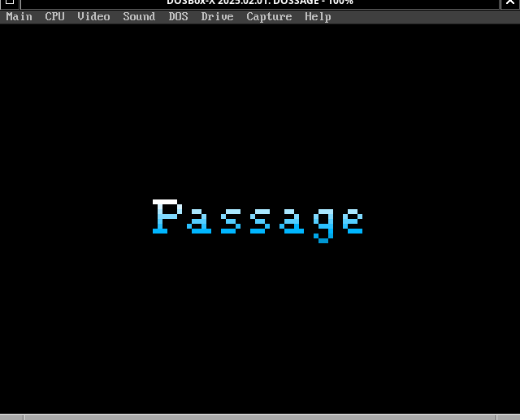
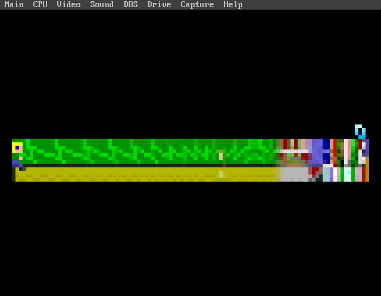

# DOSSAGE

DOSSAGE is a port of Jason Rohrer's [Passage](https://hcsoftware.sourceforge.net/passage/) (2007) to MS-DOS on retro 486/Pentium-class hardware. It plays Rohrer's five-minute memento-mori game on real 1990s-era PCs via [SDL3](https://www.libsdl.org/)'s [DOS backend](https://github.com/libsdl-org/SDL/pull/15377), [DJGPP](https://www.delorie.com/djgpp/), and [CWSDPMI](https://en.wikipedia.org/wiki/DOS_Protected_Mode_Interface).

The name is a portmanteau of **DOS** and **Passage**, matching the naming convention of its sibling port [doskutsu](https://forgejo.ecliptik.com/ecliptik/doskutsu) (DOS + Doukutsu Monogatari).

DOSSAGE exists for preservation and the engineering challenge of running Passage on a 1990s MS-DOS PC. It is also intended to become the copy-paste starting skeleton for future ports in the [sdl-dos-ports](https://forgejo.ecliptik.com/ecliptik/sdl-dos-ports) hub -- Passage's engine surface (raw SDL 1.2, no mixer/image/font libraries) is about as small as a real DOS port gets.

### Screenshots

| | |
|:---:|:---:|
|  |  |
| **Title Screen** | **Gameplay** |

<p align="center">captures from DOSBox-X running <code>DOSSAGE.EXE</code></p>

---

## Status

**PLAYABLE and real-hardware validated.** DOSSAGE boots, renders, plays with
audio, and completes full sessions on period hardware. Measured on a
486DX2-66 / 48 MB / PicoGUS (SB mode) / Cirrus CL-GD5430 rig:

| | |
|---|---|
| **Frame rate** | **14.94 fps** sustained (from 13.99 before the frame-pacer work) |
| Steady-state | 14.9989 fps |
| Audio | working (11025 Hz mono, `AUDIO_TIER=low`) |
| Visual | clean, no corruption across multi-minute runs |

**On the 15 fps target.** Passage's own `game.cpp` sets
`lockedFrameRate = 15`, which makes 15.000 fps a *ceiling* rather than a
goal: the frame pacer's deadline advances by exactly one tick per frame, so
no frame is ever permitted to run fast to repay a slow one, and the measured
average can approach 15.000 but never cross it. Steady-state sits at
14.9989 fps -- the game holding its cap to four significant figures. The
run-average shortfall is a handful of discrete ~250-325 ms stalls in the
VRAM flush (documented in `PLAN.md`); eliminating all of them would land
near 14.99, still under the ceiling. See `PLAN.md` for the full campaign,
including the eight hypotheses that were falsified along the way.

| CPU | Role |
|---|---|
| 486DX2-50 | minimum and recommended target (per `ports.yaml`) |
| 486DX2-66 | validated benchmark configuration |

---

## Game Assets

Unlike doskutsu, **DOSSAGE ships its own game data.** Passage's engine *and* its graphics/music assets were placed in the public domain by Jason Rohrer himself -- see [Components and License](#components-and-license) below -- so there is no separate "supply your own copy" step. The `.tga` graphics and the synthesized music data are vendored alongside the engine source, pinned to the same upstream revision.

---

## Requirements

### To run DOSSAGE (the DOS machine)

- **CPU:** 486DX2-50 or faster
- **RAM:** 8 MB or more (DPMI; the game itself is modest)
- **Video:** VESA 2.0+ via [UniVBE](https://en.wikipedia.org/wiki/SciTech_SNAP) strongly recommended -- see [Video cards](#video-cards) below
- **Sound:** Sound Blaster-compatible, or none (Passage runs silently without one)
- **OS:** MS-DOS 6.22 or compatible

### To build DOSSAGE (a Linux or macOS host)

- [DJGPP cross-compiler](https://github.com/andrewwutw/build-djgpp) (`i586-pc-msdosdjgpp-gcc`)
- `cmake`, `git`, `make`, `gcc`, `python3`
- `dosbox-x` -- optional, only for the local smoke test

---

## Quickstart

From a clean clone to a playable DOS build.

### 1. Clone and fetch

```bash
git clone https://forgejo.ecliptik.com/ecliptik/dossage.git
cd dossage
```

That's the whole checkout step. The shared SDL3-DOS platform layer lives at
`.sdl-dos-ports/` and is vendored into this repository as a **git subtree**,
so it arrives with the clone -- there is no submodule to initialise.

To pull later hub changes into it:

```bash
git subtree pull --prefix=.sdl-dos-ports \
  https://forgejo.ecliptik.com/ecliptik/sdl-dos-ports.git main --squash
```

Each such commit records the exact upstream hub SHA in its own message
(`Squashed '.sdl-dos-ports/' content from commit <sha>`), which is what makes
"this binary came from this patch series" checkable -- the same guarantee a
submodule pin gave, in plain text rather than a gitlink.

### 2. Make the DJGPP toolchain visible

The build expects `i586-pc-msdosdjgpp-gcc` on `PATH`. Either install
[build-djgpp](https://github.com/andrewwutw/build-djgpp) and add its `bin/`
to `PATH`, or symlink an existing install:

```bash
./scripts/setup-symlinks.sh    # links tools/djgpp if you keep one under ~/emulators
export PATH="$PWD/tools/djgpp/bin:$PATH"
```

### 3. Fetch upstream sources and build

```bash
./scripts/fetch-sources.sh           # SDL3, Passage, minorGems at pinned SHAs
./scripts/fetch-vendor-binaries.sh   # CWSDPMI.EXE (the DPMI host)
./scripts/apply-patches.sh           # apply this port's patch series

make sdl3                            # cross-build SDL3 for DOS (~10 min)
make render-music AUDIO_TIER=low     # pre-render SONG.WAV from Passage's synth
make game        AUDIO_TIER=low      # build/dossage.exe
make stage       AUDIO_TIER=low      # assemble build/stage/
```

> **`AUDIO_TIER` must match across all three commands.** It selects both the
> compiled-in audio format and the rendered `SONG.WAV`, and a mismatch is not
> a build error -- it plays the music at the wrong speed. `low` is
> 11025 Hz mono (validated on real hardware); `high` is 22050 Hz stereo
> (never real-hardware tested). If you switch tiers, re-run all three.

### 4. Smoke-test locally (optional)

```bash
tools/dosbox-launch.sh --fast --stage --exe DOSSAGE.EXE
```

DOSBox-X is a correctness check only -- **never** a performance proxy. Its
timing bears no relation to real hardware.

### 5. Copy to the DOS machine

`build/stage/` holds everything needed. Copy these onto the DOS machine
(floppy, CF card, network -- whatever you have) into a directory such as
`C:\DOSSAGE\`:

```
DOSSAGE.EXE      the game
CWSDPMI.EXE      DPMI host -- must sit alongside DOSSAGE.EXE or be on PATH
CWSDPMI.DOC      CWSDPMI's redistribution terms -- keep with the .EXE
graphics/        .tga art assets
music/           SONG.WAV + music.tga
settings/        .ini files (width, height, etc.)
```

`CWSDPMI.DOC` is not optional if you pass copies on: CWSDPMI is freeware and
redistributable, but its own terms must travel with the binary. `make stage`
places it automatically and refuses to run without it.

Ignore `LOGS/` and `CWSDPMI.SWP` if they appear -- both are runtime
artifacts, not build outputs.

### 6. Run it

```
C:\> CD \DOSSAGE
C:\DOSSAGE> DOSSAGE.EXE
```

Any key dismisses the title screen and starts the game. Arrow keys move.
**Q** or **ESC** quits, printing a frame-rate summary. A full playthrough is
about five minutes -- that is the whole point of the piece.

To capture the frame-rate line for benchmarking:

```
C:\DOSSAGE> DOSSAGE.EXE > RESULT.TXT
```

---

## Video cards

**No per-card environment variables or configuration are needed.** The two
hints this port depends on (`SDL_HINT_DOS_PREFER_LFB` and
`SDL_HINT_DOS_MAX_BPP=16`) are compiled in and applied at startup, so
swapping cards needs no `SET` commands, no batch files, and no edits.

**You must re-run UniVBE's `UVCONFIG.EXE` after every card swap.** UniVBE
silently declines to install for a card it was not configured for, and DOS
then falls back to the card's bare ROM VBE -- which on this port looks like
a crash or a badly wrong video mode, with no error message pointing at the
real cause. This bit us: a Cirrus came up reporting VBE 1.2 until UVCONFIG
was re-run, after which it reported `Universal VESA VBE 6.70 (VBE 3.0)`.
`UVCONFIG.EXE` is interactive and cannot be safely automated.

| Card | Status |
|---|---|
| **Cirrus CL-GD5430/5434** | **Validated.** Runs banked -- the shared layer force-disables LFB on this chip for a genuine hardware aperture defect. 14.94 fps. |
| **S3 ViRGE (86C375)** | **Validated.** Uses LFB at 320x240x16. 14.16-14.5 fps. |
| **ATI Mach64** | **Not yet verified with the current build.** Expected to work, but the compiled-in `MAX_BPP=16` cap changes which VESA mode it negotiates -- it previously ran 640x480x24 banked, since it has no 320x240 mode. Worth a confirmation run before trusting a benchmark number from it. |

## How This Project Is Developed

DOSSAGE is developed agentically with [Claude Code](https://claude.com/code), following the same model as doskutsu:

- **Claude Code authors the patches** across the SDL3 DOS backend and the Passage engine. They land as `patches/<vendor>/NNNN-*.patch` files in this repository.
- **Human developers drive testing and iteration**: real-hardware playthroughs, bug reports, and deciding what to fix next.
- **Workspace-local patches only.** This project does not contribute patches upstream to [libsdl-org/SDL](https://github.com/libsdl-org/SDL), [libsdl-org/SDL_mixer](https://github.com/libsdl-org/SDL_mixer), [jasonrohrer/Passage](https://github.com/jasonrohrer/Passage), or [jasonrohrer/minorGems](https://github.com/jasonrohrer/minorGems).

---

## Components and License

DOSSAGE's own source -- the build system, scripts, and documentation -- is **MIT-licensed** ([LICENSE](./LICENSE)). Unlike doskutsu, the shipped binary carries no copyleft obligation: Passage and its minorGems dependency are both public domain, and SDL3 is zlib. See [LICENSE-REVIEW.md](./LICENSE-REVIEW.md) for the full review.

| Component | Purpose | License | In `DOSSAGE.EXE` |
|---|---|---|---|
| [DOSSAGE port source](./LICENSE) (this repo) | Build system, patches, scripts, docs | MIT | n/a - source, not the binary |
| [Passage](https://github.com/jasonrohrer/Passage) | The game itself, by Jason Rohrer (2007) | [Public domain](https://hcsoftware.sourceforge.net/passage/) | Yes |
| [minorGems](https://github.com/jasonrohrer/minorGems) | Rohrer's own utility library (file/string/time/thread/TGA-decode subset only) | [Public domain](https://github.com/jasonrohrer/minorGems/blob/master/no_copyright.txt) | Yes |
| [SDL3](https://www.libsdl.org/) | Platform layer; its [DOS backend](https://github.com/libsdl-org/SDL/pull/15377) is what makes the port possible, including audio (Passage's own synth drives SDL3's core audio-stream API directly -- no SDL3_mixer, no file-decode codec) | [zlib](https://github.com/libsdl-org/SDL/blob/main/LICENSE.txt) | Yes |
| [DJGPP](https://www.delorie.com/djgpp/) libc | 32-bit DOS C runtime, by DJ Delorie | [GPL + runtime exception](https://www.delorie.com/djgpp/v2faq/faq11_2.html) | Yes - the exception permits static linking |
| [CWSDPMI](https://www.delorie.com/pub/djgpp/current/v2misc/) | DPMI host, by Charles W. Sandmann | freeware, redistributable | No - ships alongside as a separate program |

Full attribution detail: [THIRD-PARTY.md](./THIRD-PARTY.md).
