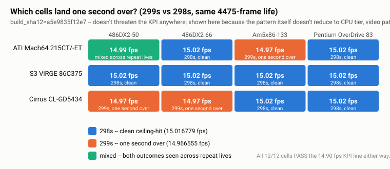

# Benchmark results index

Raw per-cell real-hardware results from the 3-card x 4-CPU performance
campaign (closed 2026-09-05, `build_sha12=a5e9835f12e7`). For the full
narrative -- how the campaign was scoped, the fix-validation arc, and
the investigation behind every finding below -- see
[`../BENCHMARK-PLAN.md`](../BENCHMARK-PLAN.md). This page is the index
and the summary; that one is the story.

## Result

**12/12 PASS** against the 14.90 fps KPI line (Passage's own source caps
the game at 15 fps by design -- see the main
[README](../../README.md#status)).

| CPU | ATI Mach64 215CT/-ET | S3 ViRGE 86C375 | Cirrus CL-GD5430/5434 |
|---|---:|---:|---:|
| Pentium OverDrive 83 | 15.02 fps | 15.02 fps | 15.02 fps |
| Am5x86-133 | 14.97 fps | 15.02 fps | 15.02 fps |
| 486DX2-66 | 15.02 fps | 15.02 fps | 14.97 fps |
| 486DX2-50 | 14.99 fps | 15.02 fps | 14.97 fps |

The tight 14.97-15.02 clustering is the pacer doing its job -- a fixed
15 fps ceiling, not "CPU doesn't matter." Every cell is one full,
uninterrupted natural life, 4475 frames long.

## The one real texture in the data

A reproducible effect where a handful of cells land the same
4475-frame life one second longer than the rest (299s instead of 298s,
14.966555 vs. 15.016779 fps) -- never a KPI risk, but genuinely
interesting because it does **not** reduce to CPU tier, video path, or
framebuffer size alone. ViRGE never shows it; Mach64 and Cirrus each
show it on a different, non-overlapping subset of CPU tiers; the
tightest-margin pairing (486DX2-50 + Mach64) has landed on both
outcomes across repeat lives. Working theory: overall margin sets how
close a pairing sits to the rounding boundary, and per-life timing
jitter decides which side any individual life lands on.

## Final results, per cell

The datum each row of the table above is drawn from -- all twelve on
the same merged build (`build_sha12=a5e9835f12e7`).

### ATI Mach64 215CT/-ET

| CPU | Result | Log |
|---|---:|---|
| 486DX2-50 | 14.99 fps | [`mach64-215ct-486dx2-50-round3-2026-09-04.md`](mach64-215ct-486dx2-50-round3-2026-09-04.md) |
| 486DX2-66 | 15.02 fps | [`mach64-215ct-486dx2-66-2026-09-05.md`](mach64-215ct-486dx2-66-2026-09-05.md) |
| Am5x86-133 | 14.97 fps | [`mach64-215ct-am5x86-2026-09-05.md`](mach64-215ct-am5x86-2026-09-05.md) |
| Pentium OverDrive 83 | 15.02 fps | [`mach64-215ct-pod83-2026-09-05.md`](mach64-215ct-pod83-2026-09-05.md) |

### S3 ViRGE 86C375

| CPU | Result | Log |
|---|---:|---|
| 486DX2-50 | 15.02 fps | [`virge-86c375-486dx2-50-2026-09-04.md`](virge-86c375-486dx2-50-2026-09-04.md) |
| 486DX2-66 | 15.02 fps | [`virge-86c375-486dx2-66-2026-09-04.md`](virge-86c375-486dx2-66-2026-09-04.md) |
| Am5x86-133 | 15.02 fps | [`virge-86c375-am5x86-2026-09-04.md`](virge-86c375-am5x86-2026-09-04.md) |
| Pentium OverDrive 83 | 15.02 fps | [`virge-86c375-pod83-2026-09-04.md`](virge-86c375-pod83-2026-09-04.md) |

### Cirrus CL-GD5430/5434

| CPU | Result | Log |
|---|---:|---|
| 486DX2-50 | 14.97 fps | [`cirrus-cl-gd5434-486dx2-50-2026-09-05.md`](cirrus-cl-gd5434-486dx2-50-2026-09-05.md) |
| 486DX2-66 | 14.97 fps | [`cirrus-cl-gd5434-486dx2-66-2026-09-05.md`](cirrus-cl-gd5434-486dx2-66-2026-09-05.md) |
| Am5x86-133 | 15.02 fps | [`cirrus-cl-gd5434-am5x86-2026-09-05.md`](cirrus-cl-gd5434-am5x86-2026-09-05.md) |
| Pentium OverDrive 83 | 15.02 fps | [`cirrus-cl-gd5434-pod83-2026-09-04.md`](cirrus-cl-gd5434-pod83-2026-09-04.md) |

## Superseded / investigation records

Kept for the record, not part of the closed 12-cell result -- earlier
measurements on a pre-merge build, or the fix-validation arc that
produced the 486DX2-50 Mach64 datum above. Each file explains its own
status inline.

| File | What it is |
|---|---|
| [`mach64-215ct-2026-09-03.md`](mach64-215ct-2026-09-03.md) | Original 486DX2-66 matrix entry (pre-merge build) -- also where the Mach64 320x240-vs-512x384-vs-640x480 mode-negotiation tie-break was first root-caused |
| [`mach64-215ct-486dx2-50-2026-09-03.md`](mach64-215ct-486dx2-50-2026-09-03.md) | Original 486DX2-50 + Mach64 datum, pre-fix (corrected in place once the fix-validation arc below closed) |
| [`mach64-215ct-486dx2-50-round1-2026-09-04.md`](mach64-215ct-486dx2-50-round1-2026-09-04.md) | Fix-validation Round 1 -- pacer-timing (patch 0036) and audio-tier fixes confirmed |
| [`mach64-215ct-486dx2-50-round2-2026-09-04.md`](mach64-215ct-486dx2-50-round2-2026-09-04.md) | Fix-validation Round 2 -- Phase 2 fixes confirmed, high tier still 0.08fps short |
| [`mach64-215ct-am5x86-2026-09-03.md`](mach64-215ct-am5x86-2026-09-03.md) | Original Am5x86-133 + Mach64 datum (pre-merge build) |
| [`mach64-215ct-pod83-2026-09-03.md`](mach64-215ct-pod83-2026-09-03.md) | Original Pentium OverDrive 83 + Mach64 datum (pre-merge build) -- also the CPU-identity investigation (confirmed genuinely Intel Pentium OverDrive, not Am5x86) |
| [`virge-86c375-2026-09-03.md`](virge-86c375-2026-09-03.md) | Original 486DX2-66 + ViRGE datum (pre-merge build, predates the audio-tier fix) |
| [`cirrus-cl-gd5434-2026-09-02.md`](cirrus-cl-gd5434-2026-09-02.md) | Original 486DX2-66 + Cirrus datum, `build_sha12=9c90db0e7905` |
| [`cirrus-cl-gd5434-2026-09-02-f1f867ccadad.md`](cirrus-cl-gd5434-2026-09-02-f1f867ccadad.md) | Same leg re-confirmed under `build_sha12=f1f867ccadad` |
